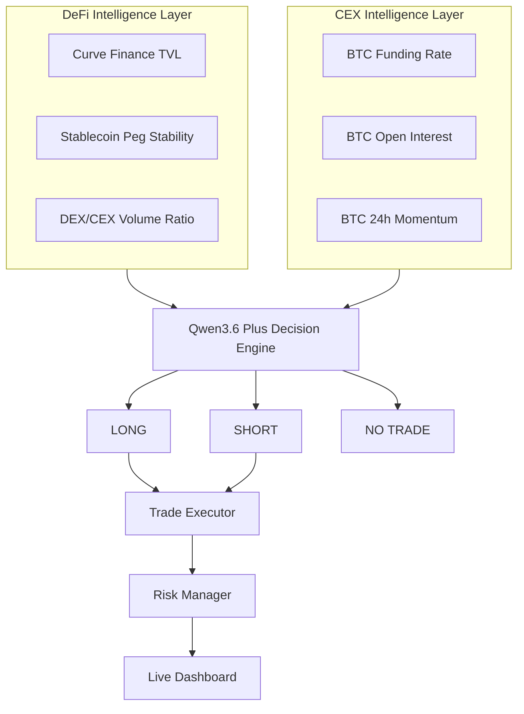
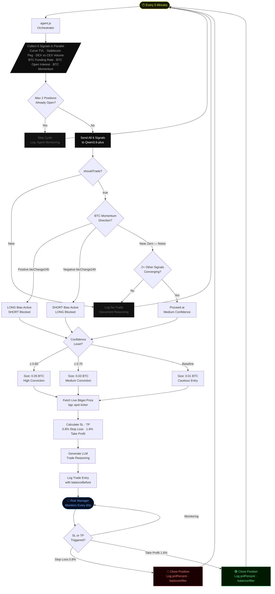
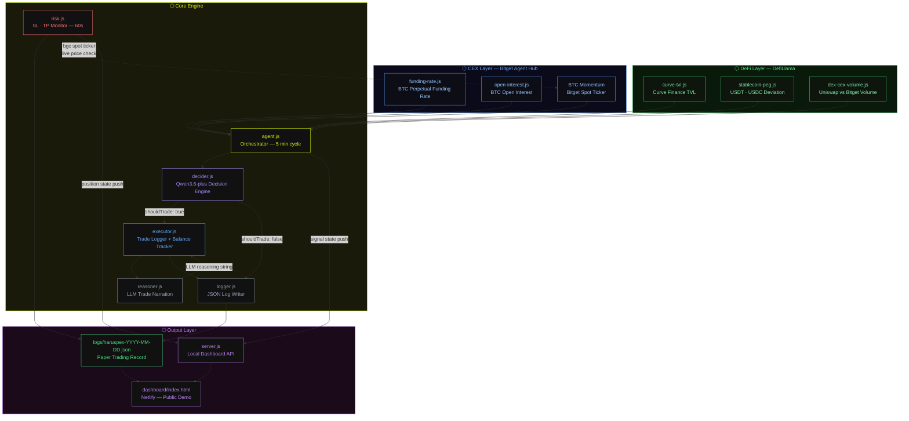

<p align="center">
  
  
  
  
</p>
<h1 align="center">HARUSPEX</h1>
<h3 align="center">Autonomous DeFi-to-CEX Signal Agent</h3>
<p align="center">
  <em>Haruspex (n.): An ancient diviner who read entrails to predict the future.<br>This agent reads DeFi entrails to predict CEX price moves.</em>
</p>
<p align="center">
  <a href="https://haruspex.netlify.app"><strong>Live Demo →</strong></a>
  &nbsp;·&nbsp;
  <a href="./logs"><strong>Paper Trading Log →</strong></a>
  &nbsp;·&nbsp;
  <a href="https://github.com/phllp-tanstic/haruspex"><strong>GitHub →</strong></a>
</p>


## Executive Summary

Haruspex is an autonomous trading agent that continuously monitors DeFi protocol health and converts cross market risk signals into executable trading decisions on **Bitget**.

Haruspex addresses a critical market intelligence gap between decentralized and centralized trading venues. While most traders rely on centralized exchange data, significant market signals often emerge first within DeFi through liquidity migrations, stablecoin stress events, and shifts in decentralized trading activity. By the time these developments are reflected in centralized markets, a substantial portion of the opportunity has already been captured.

Haruspex continuously monitors both environments as a unified market system. As capital flows between DeFi and centralized exchanges, changes in on chain conditions frequently precede shifts in market structure, volatility, and directional price movement. These cross market dynamics create actionable opportunities that are largely inaccessible to strategies operating within a single venue.

At the core of Haruspex is a six signal intelligence engine powered by Qwen3.6 Plus. Rather than relying on predefined rules or static thresholds, the system evaluates market conditions holistically every five minutes using large language model reasoning. Based on its assessment, Haruspex autonomously generates trade decisions, including position sizing, risk parameters, profit targets, and a transparent reasoning narrative. The result is a continuously operating AI trading agent capable of interpreting complex market conditions and responding in real time across market cycles.


## Problem Statement

### Market Intelligence Gap
Most algorithmic trading systems operate exclusively within centralized exchanges, relying on price action, volume, order book data, and technical indicators derived from the same market they trade. As a result, these systems compete on increasingly commoditized information with limited opportunities for differentiated insight.

Meanwhile, critical market signals often emerge first within decentralized finance. Liquidity migrations, stablecoin stress events, shifts in decentralized trading activity, and changes in protocol health frequently precede broader market movements. Despite their predictive value, these signals remain largely disconnected from traditional trading infrastructure due to the complexity of aggregating and interpreting data across multiple on chain and off chain environments.

### Why Existing Approaches Are Insufficient

| Approach | Limitation |
|-----------|------------|
| CEX Only Trading Bots | Operate exclusively on centralized exchange data and lack visibility into emerging DeFi market conditions. |
| DeFi Analytics Platforms | Provide monitoring and visualization but do not convert insights into executable trading decisions. |
| Manual Market Analysis | Cannot continuously evaluate multiple signal streams and market conditions at machine speed. |
| Rule Based Trading Systems | Depend on static thresholds that struggle to capture complex relationships between converging market signals. |
| Single Signal Strategies | Rely on isolated indicators, resulting in limited context and a higher probability of false positives. |

### The Haruspex Approach

Haruspex bridges the gap between decentralized market intelligence and centralized execution. The system continuously monitors protocol health, liquidity flows, stablecoin stability, and trading activity across DeFi while incorporating centralized exchange market data to maintain a unified view of market conditions.

At the core of the platform is a Qwen3.6 Plus powered reasoning engine that evaluates multiple signals holistically rather than through predefined rules or thresholds. Every decision is based on cross market signal convergence, enabling the system to identify opportunities that may not be visible within any single environment.

When sufficient conviction is established, Haruspex autonomously generates and executes trades on Bitget with position sizing, risk parameters, profit targets, and transparent reasoning attached to every decision.


## Solution Overview

### High-Level Architecture



### End-to-End User Journey

1. **Signal Collection**  
   Haruspex initiates a decision cycle by collecting six independent market signals across DeFi and centralized exchange environments. All data sources are queried in parallel to ensure a synchronized market snapshot.

2. **Market Reasoning**  
   The collected signals are passed to the Qwen3.6 Plus reasoning engine, which evaluates cross market conditions using a structured thesis framework. Rather than relying on predefined rules, the model synthesizes all available information to form a holistic market assessment.

3. **Trade Decision Generation**  
   Based on the current market state, the agent determines:
   - Trade direction (Long, Short, or No Trade)
   - Target asset
   - Confidence level
   - Position size
   - Stop loss
   - Take profit
   - Natural language reasoning

4. **Trade Execution**  
   When a trade is approved, the execution layer retrieves live market data from Bitget, calculates precise risk parameters, and records the position along with account balance and decision metadata.

5. **Risk Management**  
   The risk manager continuously monitors all open positions and evaluates stop loss and take profit conditions at regular intervals. Positions are automatically closed when predefined risk or profit targets are reached.

6. **Performance Tracking and Visualization**  
   The dashboard updates in real time with:
   - Current signal values
   - Open and closed positions
   - Account performance
   - Win rate metrics
   - Decision history
   - Agent reasoning logs

### Key Innovations

**Cross Market Intelligence:**
Haruspex unifies decentralized and centralized market intelligence within a single autonomous decision framework. By combining protocol health metrics, liquidity flows, stablecoin stability, decentralized trading activity, and centralized exchange market data, the system identifies opportunities that are not visible from either environment in isolation.

**AI Native Decision Making:**
Rather than relying on predefined rules, static thresholds, or signal scoring systems, Haruspex uses Qwen3.6 Plus as a reasoning layer. The model evaluates all available market signals holistically, weighs competing market conditions, and generates decisions based on the overall market context. Each decision is accompanied by a natural language explanation that provides transparency into the agent's reasoning process.

**Dynamic Signal Resolution:**
Market signals rarely align perfectly. When indicators present conflicting views, Haruspex resolves uncertainty through contextual analysis rather than rigid decision trees. Momentum, market structure, capital flows, and protocol health are evaluated collectively to determine the highest conviction outcome, enabling the system to maintain directional clarity in complex market conditions.

**Autonomous End to End Execution:**
Haruspex combines signal collection, market reasoning, trade generation, execution, risk management, and performance tracking within a single continuous workflow. The result is an autonomous trading agent capable of monitoring multiple market environments and responding in real time without manual intervention.


## Strategy Implementation

### Signal Collection Layer
Each signal runs as an independent async module. All six signals execute in parallel every 5 minutes using `Promise.all`. Signal failures are handled gracefully and return null without interrupting the cycle.

```javascript
const [curveData, stableData, fundingData, dexCexData, oiData] = await Promise.all([
  checkCurveTVL().catch(() => {}),
  checkStablecoinPeg().catch(() => {}),
  checkFundingRateDivergence().catch(() => {}),
  checkDexCexDivergence().catch(() => {}),
  checkOpenInterest().catch(() => {})
]);

// BTC 24h momentum fetched separately from Bitget ticker
```

### Decision Flow




### Cross Signal Thesis Framework

The LLM operates on a structured decision framework provided in the system prompt for every cycle. Signals are evaluated jointly to determine market regime, capital flow direction, and trade eligibility.

| Signal Combination | Interpretation | Action |
|--------------------|----------------|--------|
| OI rising + TVL dropping + negative funding | Leverage building on CEX while DeFi deleverages | LONG BTC (high confidence) |
| Stablecoin depeg + TVL drop + DEX spike | Systemic DeFi stress, capital flight | SHORT BTC/ETH |
| Negative funding + negative momentum | Shorts crowded, price confirming downtrend | SHORT (momentum confirms trend) |
| Positive funding + positive momentum | Longs crowded, price confirming uptrend | LONG (momentum confirms trend) |
| Funding conflicts with momentum | Momentum overrides conflicting funding signals | Follow momentum direction |
| All signals in noise zone | No edge detected across cross signal inputs | NO TRADE |

### Confidence-Based Position Sizing

Position sizing is dynamically determined based on model confidence. Higher conviction signals result in increased allocation, while low confidence signals default to minimal exposure.

```javascript
function getPositionSize(confidence) {
  if (confidence >= 0.85) return '0.05'; // High conviction
  if (confidence >= 0.70) return '0.03'; // Medium conviction
  return '0.01';                          // Baseline
}
```


## Technology Stack

| Technology | Category | Why Chosen | Integration Role |
|-------------|----------|------------|-------------------|
| Node.js v20 | Runtime | Async/await support, native HTTPS handling, child_process orchestration | Core agent runtime for signal collection and system orchestration |
| Qwen3.6 Plus | LLM Decision Engine | Hackathon partner model with strong structured reasoning and low hallucination rate on financial JSON tasks | Processes all six signals and outputs structured trade decisions |
| Bitget Agent Hub (bgc CLI) | CEX Data and Execution | Native hackathon infrastructure with direct access to futures and market data endpoints | Provides funding rate, open interest, and executes trades |
| DefiLlama API | DeFi Data Layer | Free, reliable, no authentication required, broad coverage of DeFi metrics | Supplies TVL, stablecoin data, and DEX volume signals |
| Netlify | Dashboard Hosting | Serverless functions simplify API proxying and eliminate CORS constraints | Hosts live dashboard and API proxy layer for Bitget data |
| pnpm | Package Manager | Required dependency format for Bitget Skill Hub ecosystem | Manages project dependencies |
| dotenv | Configuration | Secure runtime environment variable management | Loads API keys and exchange credentials securely at runtime |


## API Integrations Detail

### Bitget Agent Hub (bgc CLI)

```bash
bgc futures futures_get_open_interest --productType USDT-FUTURES --symbol BTCUSDT
→ BTC open interest
```

```bash
bgc futures futures_get_current_fund_rate --symbol BTCUSDT --productType USDT-FUTURES
→ BTC funding rate
```

```bash
bgc spot spot_get_ticker --symbol BTCUSDT
→ Live BTC spot price for execution and momentum calculation
```

---

### DefiLlama APIs

```text
https://api.llama.fi/tvl/curve-dex
→ Curve Finance TVL (curve-dex)

https://stablecoins.llama.fi/stablecoins?includePrices=true
→ Stablecoin prices and peg deviation (USDT, USDC)

https://api.llama.fi/overview/dexs/uniswap-v3?excludeTotalDataChartBreakdown=false
→ Uniswap V3 trading volume and liquidity activity
```

---

### Qwen3.6 Plus (hackathon.bitgetops.com)

```text
POST /v1/chat/completions
→ Trade decision engine (decider.js)
→ Trade reasoning engine (reasoner.js)

Temperature: 0.2 (deterministic financial decision stability)

Post-processing:
- Strip <think> tags before JSON parsing
- Enforce structured JSON output for execution pipeline
```


## System Architecture



### Component Breakdown

| File | Role | Inputs | Outputs |
|------|------|--------|----------|
| agent.js | Master orchestrator, runs every 5 minutes | All 6 signal modules | marketData object passed to decider.js |
| decider.js | LLM trade decision engine | marketData (6 signals) | JSON: shouldTrade, action, asset, confidence, SL, TP, reasoning |
| executor.js | Trade execution and balance tracking | LLM decision, live price | Trade log entry with updated balance |
| risk.js | Position monitoring system | Open trade logs, live price feed | Updated logs with closePrice, pnlPercent, balanceAfter |
| reasoner.js | LLM trade narration layer | Signal values, entry details | Natural language reasoning output |
| logger.js | Persistent JSON log writer | Trade objects | Appends structured records to daily log files |
| server.js | Local dashboard API layer | Agent and risk state | /api/state, /api/risk, /api/logs |

---

### Signal Modules

| File | Purpose | Data Source | Output |
|------|---------|-------------|--------|
| signals/curve-tvl.js | Curve liquidity tracking | DefiLlama API | { curveTVL, curveTVLChange } |
| signals/stablecoin-peg.js | Stablecoin depeg detection | DefiLlama stablecoin API | { usdtDeviation, usdcDeviation } |
| signals/dex-cex-volume.js | DEX vs CEX activity ratio | DefiLlama + Bitget | { dexCexRatio, uniswapTotal24h, bitgetEthVolume } |
| signals/funding-rate.js | BTC funding rate monitor | Bitget Agent Hub CLI | { fundingRate, tvlStable } |
| signals/open-interest.js | Futures positioning pressure | Bitget Agent Hub CLI | { openInterest, openInterestChange } |

---

### Infrastructure Components

| File | Role | Description |
|------|------|-------------|
| netlify/functions/bitget.js | CORS proxy layer | Enables browser access to Bitget API responses |
| dashboard/index.html | Live system UI | Displays signals, trades, and performance metrics |
| dashboard/trades.json | Historical trade store | Static export of daily execution logs |
| Netlify fallback data | Backup dataset | Ensures dashboard availability during API downtime |


DATA FLOWWWWWWWWWWWWWWWWWWWWWWWWWWWWWWWWWWWWWWWWWWWWWWWWWWWWWWWWWWW DATA DIAGRAM


## How It Works

### Step by Step Walkthrough

---

### Step 1 - Data Collection (parallel, ~8 seconds)

Every 5 minutes, `agent.js` triggers all 6 signal collectors in parallel.

```text
[Open Interest] BTC OI: 32,984.50 BTC | Change: 0%
[Curve TVL] Current: $1.46B | Change: 0%
[Funding Rate] BTC: -0.0012% | DeFi TVL stable: true
[Stablecoin] USDT: $0.9991 | Deviation: 0.0919%
[Stablecoin] USDC: $0.9998 | Deviation: 0.0171%
[DEX/CEX] Uniswap V3 24h: $583.1M | Bitget ETH 24h: $247.8M | Ratio: 2.3534
[BTC Momentum] 24h change: -0.479%
```

---

### Step 2 - Signal Aggregation

All signals are merged into a single `marketData` object and passed to the LLM.

```text
[HARUSPEX] Signals:
CurveTVL=0% | USDT=0.0919% | Funding=-0.0012% | DEX/CEX=2.353 | OI=0% | BTC24h=-0.479%
```

---

### Step 3 - LLM Decision

Qwen3.6 Plus processes all signals using the cross signal thesis framework and returns structured JSON.

```json
{
  "shouldTrade": true,
  "action": "SHORT",
  "asset": "BTCUSDT",
  "confidence": 0.6,
  "signal": "multi-signal-convergence",
  "reasoning": "BTC 24h momentum of -0.479% overrides the negative funding rate and mandates SHORT bias. Confirmed by DEX/CEX ratio of 2.353 indicating DeFi rotation preceding CEX volatility.",
  "stopLoss": 0.008,
  "takeProfit": 0.016
}
```

---

### Step 4 - Execution

```text
[EXECUTOR] Signal confirmed — placing paper trade
Asset: BTCUSDT | Side: SELL | Size: 0.01
[EXECUTOR] Entry price: $65,893.55
[EXECUTOR] Stop loss: $66,223.02 (0.8% above entry)
[EXECUTOR] Take profit: $65,234.61 (1.6% below entry)
[EXECUTOR] Account balance: $9,990.12
```

---

### Step 5 - Risk Monitoring (every 60 seconds)

```text
[Risk] BTCUSDT | Entry: $65,893 | Current: $65,608 | SL: $66,223 | TP: $65,234
[Risk] Position healthy — PnL: +0.43%
```

---

### Step 6 - Auto Close and Balance Update

When stop loss or take profit is triggered:

```text
[Risk] TAKE_PROFIT_HIT — BTCUSDT @ $65,234 | PnL: +1.00% ($19.77) | Balance: $10,009.89
```

Trade logs are updated with:
- closePrice  
- pnlPercent  
- balanceAfter  
- balanceChange